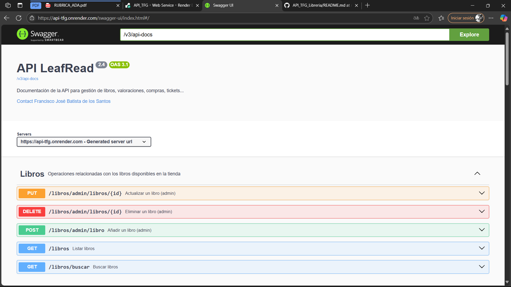
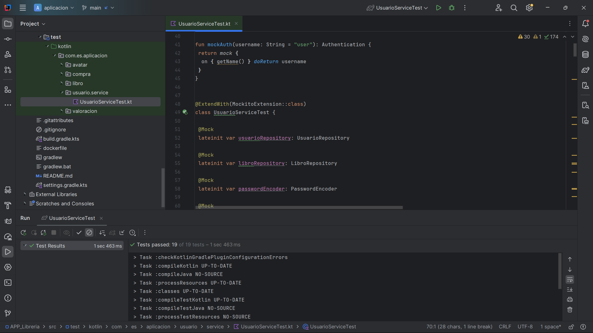
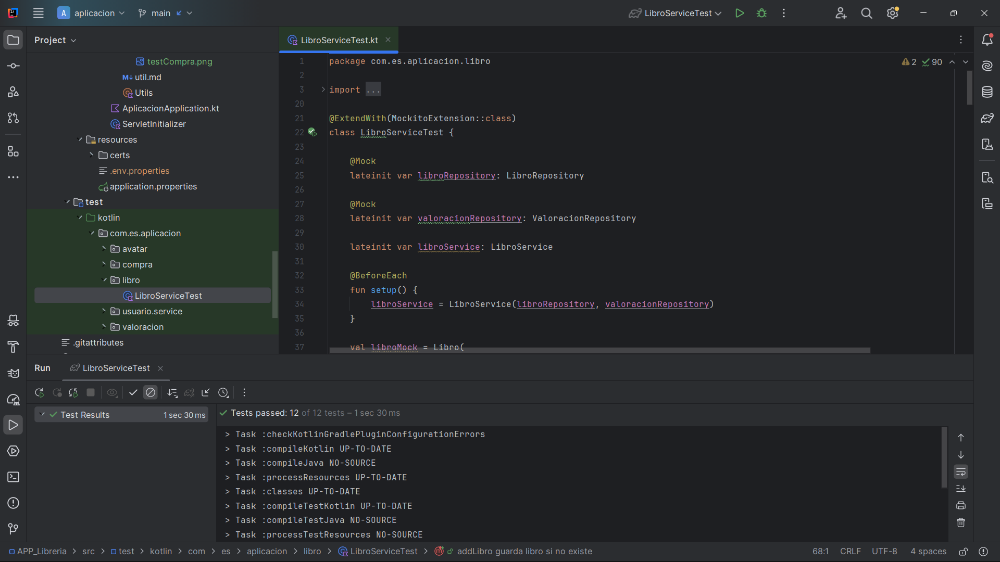
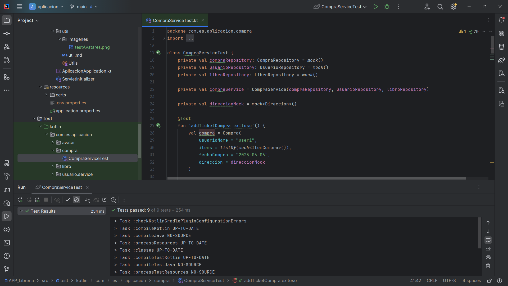
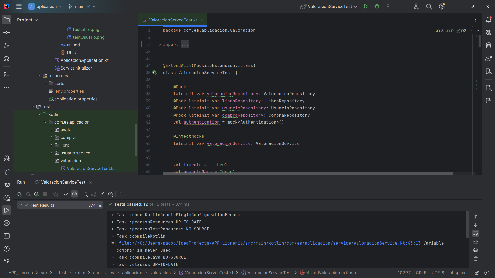
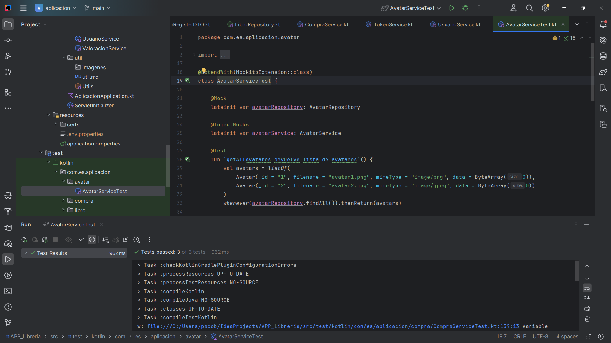

# README - App LeafRead

## Descripción de la Aplicación

Esta aplicación es un sistema backend desarrollado en Kotlin con Spring Boot, que permite gestionar usuarios, libros, compras, avatares y valoraciones. El sistema contempla roles diferenciados para usuarios y administradores, control de stock, y funcionalidades de compra con integración de pagos.

---

## Documentación Swagger

La documentación de la API fue implementada utilizando **Springdoc OpenAPI** con Swagger UI.

Puedes acceder a la documentación interactiva aquí:
 🔗 [Swagger UI](https://api-tfg.onrender.com/swagger-ui/index.html#/)

Disponible solo cuando Render está en funcionamiento.!!

---

## Modelos principales

- **Usuario**: almacena datos del usuario, incluyendo roles, direcciones, lista de libros favoritos, cesta de compra y avatar.  
- **Libro**: representa libros con información detallada como título, autores, descripción, precio, categorías, stock y valoraciones.  
- **Compra**: contiene información sobre las compras realizadas, incluyendo items (libros + cantidad), fecha y dirección de entrega.  
- **Avatar**: representa la imagen del usuario.  
- **Valoración**: guarda la valoración y comentario que un usuario deja sobre un libro.  

---

## Estructura general y colecciones en BD (MongoDB)

### Usuario

- `_id`: String  
- `username`: String  
- `password`: String (hashed)  
- `email`: String  
- `roles`: String? (default "USER")  
- `direccion`: List<Direccion>  
- `librosfav`: List<String> (IDs de libros favoritos)  
- `cesta`: List<ItemCompra>  
- `avatar`: String (ID de avatar)  

### Libro

- `_id`: String  
- `titulo`: String  
- `autores`: List<String>  
- `descripcion`: String  
- `precio`: Double  
- `moneda`: String  
- `imagen`: String (URL o base64)  
- `enlaceEbook`: String  
- `isbn13`: String  
- `categorias`: List<String>  
- `valoracionMedia`: Double  
- `stock`: Stock (tipo y número)  

### Compra

- `usuarioName`: String  
- `items`: List<ItemCompra>  
- `fechaCompra`: String (fecha en formato ISO)  
- `direccion`: Direccion (calle, número, municipio, provincia)  

### Avatar

- `_id`: String  
- `filename`: String  
- `mimeType`: String  
- `data`: ByteArray (imagen)  

### Valoración

- `_id`: String  
- `libroid`: String  
- `usuarioName`: String  
- `valoracion`: Int (ej. 1 a 5)  
- `comentario`: String  
- `fecha`: LocalDateTime  

---

## Funcionalidades clave

### Usuarios

- Registro y login con validación de datos.  
- Gestión de direcciones y avatar.  
- Gestión de libros favoritos y cesta de compra.  

### Libros

- CRUD para libros (solo admin para creación, actualización y borrado).  
- Consulta pública de libros con filtros por categoría y autor.  
- Búsqueda de libros por texto libre.  
- Gestión de stock y valoraciones.  

### Compras

- Creación de sesiones de pago (checkout).  
- Verificación del estado de pago.  
- Registro de tickets de compra.  
- Consulta de tickets (usuario y admin).  
- Actualización automática de stock tras compra.  

### Avatares

- Consultar avatar por ID.  
- Listar todos los avatares disponibles.  

### Valoraciones

- Usuarios pueden valorar libros con puntuación y comentario.
- Usuarios pueden comentar si han comprado el libro.
- Registro de fecha automática.  

---

## Seguridad

- JWT para autenticación.  
- Roles `USER` y `ADMIN` para control de acceso.  
- Endpoints protegidos según rol.  
- Validación de datos en DTOs y control de accesos para evitar modificación o consulta indebida.  

---

## Endpoints Principales

| Método  | Ruta                         | Descripción                              | Roles        |
|---------|------------------------------|----------------------------------------|--------------|
| POST    | `/usuarios/login`             | Login de usuario, devuelve token JWT   | Público      |
| POST    | `/usuarios/register`          | Registro de usuario                     | Público      |
| GET     | `/libros`                    | Listar libros con filtros               | Público      |
| POST    | `/admin/libro`               | Crear libro                            | Admin        |
| PUT     | `/admin/libros/{id}`         | Actualizar libro                       | Admin        |
| DELETE  | `/admin/libros/{id}`         | Borrar libro                          | Admin        |
| POST    | `/compra/checkout`           | Crear sesión de pago                   | Usuario      |
| GET     | `/compra/estado/{sessionId}` | Consultar estado del pago              | Usuario      |
| POST    | `/compra/ticket`             | Registrar ticket de compra             | Usuario      |
| GET     | `/compra/tickets`            | Obtener tickets de usuario             | Usuario      |
| GET     | `/compra/admin/tickets`      | Obtener todos los tickets              | Admin        |
| POST    | `/compra/actualizar-stock`   | Actualizar stock tras compra           | Usuario      |
| GET     | `/avatar/miAvatar/{idAvatar}`| Obtener avatar por ID                  | Usuario      |
| GET     | `/avatar/allAvatares`        | Listar todos los avatares              | Usuario      |

---

## Validaciones y reglas de negocio

- Usuario: único username y email, contraseña con mínimo 5 caracteres y repetición correcta.  
- Libro: título obligatorio, stock debe ser controlado y actualizado tras compra.  
- Compra: dirección válida, cantidad > 0 dentro del stock de cada libro y obviamente la compra no puede estár vacía.  
- Valoración: rango de valoraciones entre 1 y 5, tiene que haber comprado el libro para que pueda dar su valoración y no puedes valorar 2 veces el mismo libro.  
- Avatar: imagen válida en base64 o archivo.  

---

## Manejo de errores (códigos HTTP)

| Código | Significado                     |
|--------|--------------------------------|
| 200    | OK                             |
| 201    | Created                        |
| 204    | No Content                     |
| 400    | Bad Request (validación)       |
| 401    | Unauthorized (token inválido)  |
| 403    | Forbidden (sin permiso)        |
| 404    | Not Found                      |
| 409    | Conflict (usuario o dato repetido) |
| 500    | Internal Server Error          |

---

## Ejecución y pruebas

- Se recomienda usar Postman o Insomnia para probar los endpoints.  
- Pruebas de login, registro, creación y gestión de libros, compras y valoraciones.  
- Se puede desplegar en Render o cualquier otro hosting de backend.  
- Video demostraciones disponibles para facilitar la comprensión.  

---

## Recursos adicionales

- DTOs bien definidos para control y seguridad.  
- Integración con servicios de pago externos.  
- Seguridad con Spring Security y JWT.  
- Manejo de roles y permisos.  

---

## Muestra de los TestPasados

